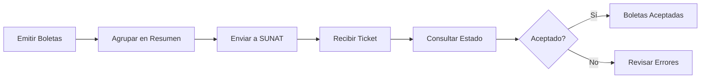
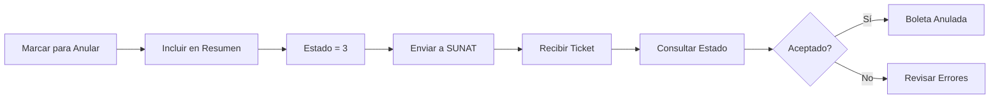

# Resúmenes Diarios de Boletas - Daily Summaries

## Tabla de Contenidos
- [¿Qué son los Resúmenes Diarios?](#qué-son-los-resúmenes-diarios)
- [Estados de Comprobantes](#estados-de-comprobantes)
- [Estructura del JSON](#estructura-del-json)
- [Flujo de Operación](#flujo-de-operación)
- [API de Anulación de Boletas](#api-de-anulación-de-boletas)
- [Ejemplos de Uso](#ejemplos-de-uso)
- [Códigos de Error Comunes](#códigos-de-error-comunes)

---

## ¿Qué son los Resúmenes Diarios?

Los **Resúmenes Diarios** (RC - Resumen de Comprobantes) son documentos electrónicos que agrupan **boletas de venta y notas de crédito/débito relacionadas** para enviarlas a SUNAT de forma consolidada.

### Características:

- ✅ Se envían **una vez al día** (generalmente al final del día)
- ✅ Agrupan **todas las boletas emitidas** en una fecha específica
- ✅ Permiten **añadir, modificar o anular** boletas
- ✅ SUNAT tiene hasta **7 días** para procesarlos
- ✅ Se envían por **sistema asíncrono** (se recibe un ticket y luego se consulta el resultado)

### Diferencia con Facturas:

| Característica | Facturas | Boletas |
|----------------|----------|---------|
| Envío a SUNAT | **Individual e inmediato** | **Agrupado en resúmenes diarios** |
| Método | Síncrono (respuesta inmediata) | Asíncrono (ticket → consulta) |
| Anulación | Nota de crédito electrónica | Comunicación de baja o Resumen |
| Plazo de respuesta | Inmediato | Hasta 7 días |

---

## Estados de Comprobantes

El campo `"estado"` en el detalle de cada comprobante indica **la operación que se está realizando** con ese documento en el Resumen Diario.

### Códigos de Estado según SUNAT:

| Código | Nombre | Descripción | Uso |
|--------|--------|-------------|-----|
| **`"1"`** | **ADICIÓN** | Agregar/reportar un comprobante nuevo | Boletas de emisión normal |
| **`"2"`** | **MODIFICACIÓN** | Modificar datos de un comprobante ya reportado | Corrección de montos o datos |
| **`"3"`** | **ANULACIÓN** | Anular un comprobante previamente reportado | Cancelación de boletas |

### Estado "1" - ADICIÓN (Emisión Normal)

**Uso más común:** Reportar boletas emitidas durante el día.

```json
{
    "tipo_documento": "03",
    "serie_numero": "B001-000001",
    "estado": "1",  // ← ADICIÓN
    "cliente_tipo": "1",
    "cliente_numero": "72727278",
    "total": "197.96",
    "mto_oper_gravadas": "91.49",
    "mto_oper_exoneradas": "90.00",
    "mto_oper_inafectas": "0.00",
    "mto_oper_gratuitas": "0.00",
    "mto_igv": "16.47",
    "mto_isc": "0.00",
    "mto_icbper": "0.00"
}
```

**Cuándo usar:**
- ✅ Boletas emitidas normalmente durante el día
- ✅ Primera vez que se reporta el comprobante
- ✅ Emisión estándar de punto de venta

### Estado "2" - MODIFICACIÓN

**Uso:** Corregir datos de una boleta ya reportada a SUNAT.

```json
{
    "tipo_documento": "03",
    "serie_numero": "B001-000005",
    "estado": "2",  // ← MODIFICACIÓN
    "cliente_tipo": "1",
    "cliente_numero": "12345678",
    "total": "250.00",  // Monto corregido
    "mto_oper_gravadas": "211.86",
    "mto_igv": "38.14",
    // ... otros campos corregidos
}
```

**Cuándo usar:**
- ⚠️ Corregir errores en montos
- ⚠️ Actualizar datos del cliente
- ⚠️ Modificar totales calculados incorrectamente

**Importante:**
- Solo se puede modificar una boleta que **ya fue aceptada** por SUNAT
- No se pueden modificar todos los campos, solo los permitidos por SUNAT

### Estado "3" - ANULACIÓN

**Uso:** Anular/cancelar una boleta previamente emitida.

```json
{
    "tipo_documento": "03",
    "serie_numero": "B001-000003",
    "estado": "3",  // ← ANULACIÓN
    "cliente_tipo": "1",
    "cliente_numero": "87654321",
    "total": "0.00",  // Se pone en 0 al anular
    "mto_oper_gravadas": "0.00",
    "mto_igv": "0.00",
    // ... todos los montos en 0
}
```

**Cuándo usar:**
- ❌ Cancelar una boleta emitida por error
- ❌ Anular venta que no se concretó
- ❌ Corrección de emisión duplicada

**Importante:**
- La anulación debe hacerse **el mismo día de emisión** o máximo **7 días después**
- Pasado ese plazo, se debe usar una **Comunicación de Baja**

---

## Estructura del JSON

### Modelo Completo del Resumen Diario

```json
{
    "company_id": 1,
    "fecha_emision": "2025-12-05",
    "fecha_referencia": "2025-12-05",
    "correlativo": "RC-20251205-001",
    "detalles": [
        {
            "tipo_documento": "03",
            "serie_numero": "B001-000001",
            "estado": "1",
            "cliente_tipo": "1",
            "cliente_numero": "72727278",
            "total": "197.96",
            "mto_oper_gravadas": "91.49",
            "mto_oper_exoneradas": "90.00",
            "mto_oper_inafectas": "0.00",
            "mto_oper_gratuitas": "0.00",
            "mto_igv": "16.47",
            "mto_isc": "0.00",
            "mto_icbper": "0.00"
        },
        {
            "tipo_documento": "03",
            "serie_numero": "B001-000002",
            "estado": "1",
            "cliente_tipo": "6",
            "cliente_numero": "20123456789",
            "total": "450.00",
            "mto_oper_gravadas": "381.36",
            "mto_oper_exoneradas": "0.00",
            "mto_oper_inafectas": "0.00",
            "mto_oper_gratuitas": "0.00",
            "mto_igv": "68.64",
            "mto_isc": "0.00",
            "mto_icbper": "0.00"
        },
        {
            "tipo_documento": "03",
            "serie_numero": "B001-000003",
            "estado": "3",
            "cliente_tipo": "1",
            "cliente_numero": "45678912",
            "total": "0.00",
            "mto_oper_gravadas": "0.00",
            "mto_oper_exoneradas": "0.00",
            "mto_oper_inafectas": "0.00",
            "mto_oper_gratuitas": "0.00",
            "mto_igv": "0.00",
            "mto_isc": "0.00",
            "mto_icbper": "0.00"
        }
    ]
}
```

### Campos del Detalle

| Campo | Tipo | Descripción | Valores Posibles |
|-------|------|-------------|------------------|
| `tipo_documento` | string | Tipo de comprobante | `"03"` = Boleta |
| `serie_numero` | string | Serie y correlativo | `"B001-000001"` |
| `estado` | string | Operación a realizar | `"1"`, `"2"`, `"3"` |
| `cliente_tipo` | string | Tipo doc. cliente | `"1"` = DNI, `"6"` = RUC |
| `cliente_numero` | string | Número doc. cliente | DNI: 8 dígitos, RUC: 11 dígitos |
| `total` | string | Monto total | Incluye IGV |
| `mto_oper_gravadas` | string | Monto gravado | Base imponible |
| `mto_oper_exoneradas` | string | Monto exonerado | Sin IGV por ley |
| `mto_oper_inafectas` | string | Monto inafecto | No afecto a IGV |
| `mto_oper_gratuitas` | string | Monto gratuito | Transferencias gratuitas |
| `mto_igv` | string | IGV calculado | 18% de gravadas |
| `mto_isc` | string | ISC (impuesto selectivo) | Productos específicos |
| `mto_icbper` | string | Impuesto bolsas plásticas | S/ 0.50 por bolsa |

---

## Flujo de Operación

### 1. Emisión Normal de Boletas (Estado "1")



**Código de implementación:**

```php
// app/Services/DocumentService.php - Línea 1510
foreach ($boletas as $boleta) {
    $detalles[] = [
        'tipo_documento' => $boleta->tipo_documento,
        'serie_numero' => $boleta->serie . '-' . $boleta->correlativo,
        'estado' => '1', // Estado 1 = Adición
        'cliente_tipo' => $boleta->client->tipo_documento ?? '1',
        'cliente_numero' => $boleta->client->numero_documento ?? '00000000',
        'total' => $boleta->mto_imp_venta,
        'mto_oper_gravadas' => $boleta->mto_oper_gravadas,
        // ... otros campos
    ];
}
```

### 2. Anulación de Boletas (Estado "3")



**Código de implementación:**

```php
// app/Services/DocumentService.php - Línea 1231
// Actualizar boletas de anulación (estado = 3)
foreach ($boletasAnulacion as $boleta) {
    $boleta->update([
        'estado_anulacion' => 'anulada',
        'estado_sunat' => 'ANULADO',
        'respuesta_sunat' => json_encode([
            'message' => 'Anulado mediante Resumen Diario',
            'summary_id' => $summary->id,
            'fecha_anulacion' => now()->toDateTimeString()
        ])
    ]);
}
```

### 3. Proceso Completo en Base de Datos

**Estados de una boleta:**

```
┌─────────────────────────────────────────────────────────┐
│  EMISIÓN                                                │
│  ------------------------------------------------       │
│  1. Boleta creada                                       │
│     - estado_sunat: NULL                                │
│     - estado_anulacion: 'sin_anular'                    │
│                                                          │
│  2. Incluida en resumen (estado: "1")                   │
│     - daily_summary_id: [ID del resumen]                │
│     - metodo_envio: 'resumen_diario'                    │
│                                                          │
│  3. Resumen aceptado por SUNAT                          │
│     - estado_sunat: 'ACEPTADO'                          │
│     - respuesta_sunat: [JSON con CDR]                   │
└─────────────────────────────────────────────────────────┘

┌─────────────────────────────────────────────────────────┐
│  ANULACIÓN                                              │
│  ------------------------------------------------       │
│  1. Marcar para anular                                  │
│     - estado_anulacion: 'pendiente_anulacion'           │
│                                                          │
│  2. Incluida en resumen (estado: "3")                   │
│     - nuevo resumen con anulación                       │
│                                                          │
│  3. Resumen aceptado por SUNAT                          │
│     - estado_anulacion: 'anulada'                       │
│     - estado_sunat: 'ANULADO'                           │
└─────────────────────────────────────────────────────────┘
```

---

## API de Anulación de Boletas

El endpoint `POST /api/v1/boletas/anular-oficialmente` permite anular boletas mediante resúmenes diarios. Soporta **dos formatos** para máxima flexibilidad:

### Formato 1: Motivo Único para Todas las Boletas

**Uso:** Cuando todas las boletas se anulan por el mismo motivo.

```http
POST {{base_url}}/api/v1/boletas/anular-oficialmente
Content-Type: application/json

{
    "company_id": 1,
    "branch_id": 1,
    "boletas_ids": [10, 11, 12],
    "motivo_anulacion": "Error en emisión"
}
```

**Resultado:**
- Boleta 10 → Motivo: "Error en emisión"
- Boleta 11 → Motivo: "Error en emisión"
- Boleta 12 → Motivo: "Error en emisión"

### Formato 2: Motivo Individual por Boleta

**Uso:** Cuando cada boleta tiene un motivo diferente de anulación.

```http
POST {{base_url}}/api/v1/boletas/anular-oficialmente
Content-Type: application/json

{
    "company_id": 1,
    "branch_id": 1,
    "boletas": [
        {
            "id": 10,
            "motivo": "Error en precio del producto"
        },
        {
            "id": 11,
            "motivo": "Cliente solicitó cancelación"
        },
        {
            "id": 12,
            "motivo": "Duplicación accidental"
        }
    ]
}
```

**Resultado:**
- Boleta 10 → Motivo: "Error en precio del producto"
- Boleta 11 → Motivo: "Cliente solicitó cancelación"
- Boleta 12 → Motivo: "Duplicación accidental"

### Validación de Campos

#### Formato 1 (Motivo Único)

| Campo | Tipo | Requerido | Descripción |
|-------|------|-----------|-------------|
| `company_id` | integer | ✅ Sí | ID de la empresa |
| `branch_id` | integer | ✅ Sí | ID de la sucursal |
| `boletas_ids` | array | ✅ Sí | Array de IDs de boletas |
| `boletas_ids.*` | integer | ✅ Sí | Cada ID debe existir en BD |
| `motivo_anulacion` | string | ✅ Sí | Motivo único (máx. 100 caracteres) |
| `usuario_id` | integer | ⚪ No | ID del usuario que anula |

#### Formato 2 (Motivos Individuales)

| Campo | Tipo | Requerido | Descripción |
|-------|------|-----------|-------------|
| `company_id` | integer | ✅ Sí | ID de la empresa |
| `branch_id` | integer | ✅ Sí | ID de la sucursal |
| `boletas` | array | ✅ Sí | Array de objetos boleta |
| `boletas.*.id` | integer | ✅ Sí | ID de la boleta |
| `boletas.*.motivo` | string | ✅ Sí | Motivo individual (máx. 100 caracteres) |
| `usuario_id` | integer | ⚪ No | ID del usuario que anula |

### Validaciones Automáticas

El sistema validará automáticamente que:

✅ La boleta esté **aceptada por SUNAT** (`estado_sunat = 'ACEPTADO'`)
✅ No esté **anulada localmente**
✅ No esté **ya en proceso de anulación** o anulada
✅ Esté dentro del **plazo de 3 días** desde su emisión
✅ Todas las boletas sean de la **misma fecha de emisión**

### Respuesta Exitosa

```json
{
    "success": true,
    "data": {
        "summary": {
            "id": 15,
            "numero_completo": "RC-20251210-001",
            "estado_proceso": "pendiente",
            "estado_sunat": null
        },
        "boletas_count": 3,
        "boletas_ids": [10, 11, 12]
    },
    "message": "Resumen de anulación creado exitosamente. Use POST /api/v1/daily-summaries/15/send-sunat para enviar a SUNAT."
}
```

### Respuesta de Error

**Error: Boleta fuera de plazo**
```json
{
    "success": false,
    "message": "La boleta B001-000010 está fuera del plazo de 3 días (emitida el 2025-12-01). Use la anulación local para boletas vencidas.",
    "dias_transcurridos": 9
}
```

**Error: Boleta no aceptada**
```json
{
    "success": false,
    "message": "La boleta B001-000011 no está aceptada por SUNAT. Solo se pueden anular boletas aceptadas."
}
```

### Ejemplos Prácticos

#### Ejemplo 1: Anular 3 Boletas por Cierre de Caja Erróneo

```json
{
    "company_id": 1,
    "branch_id": 1,
    "boletas_ids": [101, 102, 103],
    "motivo_anulacion": "Cierre de caja incorrecto - Recálculo necesario",
    "usuario_id": 5
}
```

#### Ejemplo 2: Anular Boletas con Diferentes Motivos

```json
{
    "company_id": 1,
    "branch_id": 1,
    "boletas": [
        {
            "id": 150,
            "motivo": "Producto no disponible - Venta cancelada"
        },
        {
            "id": 151,
            "motivo": "Error en cantidad facturada"
        },
        {
            "id": 152,
            "motivo": "Cliente no recogió producto en tiempo"
        },
        {
            "id": 153,
            "motivo": "Duplicación por error de sistema"
        }
    ],
    "usuario_id": 3
}
```

### Flujo Completo de Anulación

```
1. POST /api/v1/boletas/anular-oficialmente
   ↓ (Crea resumen con estado = "3")

2. POST /api/v1/daily-summaries/{id}/send-sunat
   ↓ (Envía a SUNAT - recibe ticket)

3. GET /api/v1/daily-summaries/{id}/check-sunat
   ↓ (Consulta estado con ticket)

4. Si SUNAT acepta:
   - Boletas: estado_anulacion = "anulada"
   - Boletas: estado_sunat = "ANULADO"
```

### Diferencias entre Formatos

| Aspecto | Formato 1 (Simple) | Formato 2 (Detallado) |
|---------|-------------------|----------------------|
| **Complejidad** | Menor - más rápido | Mayor - más específico |
| **Motivos** | Uno para todas | Uno por boleta |
| **Auditabilidad** | Básica | Detallada |
| **Reporte** | Genérico | Específico por boleta |
| **Uso recomendado** | Lotes homogéneos | Casos heterogéneos |

### Implementación Técnica

**Código:** `app/Http/Controllers/Api/BoletaController.php` líneas 1040-1390

**Método normalización:** `normalizarBoletasAnulacion()`

```php
// Internamente, ambos formatos se convierten a:
[
    ['id' => 10, 'motivo' => 'Motivo A'],
    ['id' => 11, 'motivo' => 'Motivo B'],
    ['id' => 12, 'motivo' => 'Motivo C']
]
```

---

## Ejemplos de Uso

### Ejemplo 1: Resumen con Solo Emisiones

**Escenario:** Vendiste 3 boletas durante el día.

```json
{
    "fecha_emision": "2025-12-05",
    "fecha_referencia": "2025-12-05",
    "detalles": [
        {
            "serie_numero": "B001-000001",
            "estado": "1",
            "total": "100.00",
            "mto_oper_gravadas": "84.75",
            "mto_igv": "15.25"
        },
        {
            "serie_numero": "B001-000002",
            "estado": "1",
            "total": "250.00",
            "mto_oper_gravadas": "211.86",
            "mto_igv": "38.14"
        },
        {
            "serie_numero": "B001-000003",
            "estado": "1",
            "total": "500.00",
            "mto_oper_gravadas": "423.73",
            "mto_igv": "76.27"
        }
    ]
}
```

### Ejemplo 2: Resumen Mixto (Emisiones + Anulación)

**Escenario:** Vendiste 2 boletas nuevas y anulaste 1 anterior.

```json
{
    "fecha_emision": "2025-12-05",
    "fecha_referencia": "2025-12-05",
    "detalles": [
        {
            "serie_numero": "B001-000004",
            "estado": "1",
            "total": "150.00",
            "mto_oper_gravadas": "127.12",
            "mto_igv": "22.88"
        },
        {
            "serie_numero": "B001-000005",
            "estado": "1",
            "total": "300.00",
            "mto_oper_gravadas": "254.24",
            "mto_igv": "45.76"
        },
        {
            "serie_numero": "B001-000002",
            "estado": "3",
            "total": "0.00",
            "mto_oper_gravadas": "0.00",
            "mto_igv": "0.00"
        }
    ]
}
```

### Ejemplo 3: Solo Anulaciones

**Escenario:** No vendiste nada hoy, pero necesitas anular 2 boletas de ayer.

```json
{
    "fecha_emision": "2025-12-05",
    "fecha_referencia": "2025-12-04",
    "detalles": [
        {
            "serie_numero": "B001-000001",
            "estado": "3",
            "total": "0.00",
            "mto_oper_gravadas": "0.00",
            "mto_igv": "0.00"
        },
        {
            "serie_numero": "B001-000003",
            "estado": "3",
            "total": "0.00",
            "mto_oper_gravadas": "0.00",
            "mto_igv": "0.00"
        }
    ]
}
```

---

## Códigos de Error Comunes

### Errores Relacionados con Estados

| Código | Descripción | Solución |
|--------|-------------|----------|
| `2324` | Comprobante no encontrado para modificar/anular | Verificar que el comprobante fue previamente reportado |
| `2325` | Estado no válido | Usar solo estados: "1", "2", "3" |
| `2326` | No se puede modificar comprobante rechazado | Solo modificar comprobantes aceptados |
| `2327` | Fecha de anulación fuera de plazo | Anular dentro de 7 días o usar Comunicación de Baja |
| `4000` | El comprobante ya fue anulado | No se puede anular dos veces |

### Validaciones Importantes

```php
// Validar que una boleta puede ser anulada
if ($boleta->estado_anulacion === 'anulada') {
    throw new Exception('La boleta ya está anulada');
}

if ($boleta->created_at->diffInDays(now()) > 7) {
    throw new Exception('Fuera del plazo de anulación (7 días)');
}

if ($boleta->estado_sunat !== 'ACEPTADO') {
    throw new Exception('Solo se pueden anular boletas aceptadas por SUNAT');
}
```

---

## Mejores Prácticas

### 1. Agrupación de Boletas

✅ **RECOMENDADO:**
- Enviar un resumen diario al final del día laboral
- Agrupar todas las boletas del día en un solo resumen
- Separar emisiones de anulaciones si son muchas

❌ **NO RECOMENDADO:**
- Enviar múltiples resúmenes el mismo día
- Mezclar fechas de referencia diferentes
- Enviar resúmenes vacíos

### 2. Manejo de Anulaciones

✅ **RECOMENDADO:**
- Anular el mismo día de emisión cuando sea posible
- Mantener registro del motivo de anulación
- Verificar que la boleta fue aceptada antes de anular

❌ **NO RECOMENDADO:**
- Anular boletas que nunca fueron enviadas
- Intentar anular después de 7 días
- Anular sin notificar al cliente

### 3. Monitoreo y Auditoría

```php
// Registrar logs detallados
Log::info('Resumen diario creado', [
    'summary_id' => $summary->id,
    'fecha_referencia' => $summary->fecha_referencia,
    'total_boletas' => count($detalles),
    'emisiones' => $boletasEmision->count(),
    'anulaciones' => $boletasAnulacion->count()
]);
```

---

## Referencias

- **Documentación SUNAT:** [Facturación Electrónica](https://cpe.sunat.gob.pe/)
- **Greenter Docs:** [GitHub - Greenter](https://github.com/thegreenter/greenter)
- **Código Fuente:** `app/Services/DocumentService.php` - Métodos relacionados con resúmenes diarios

---

**Última actualización:** Diciembre 2025
**Versión:** 1.0
**Autor:** Sistema de Facturación Electrónica - SUNAT Perú
